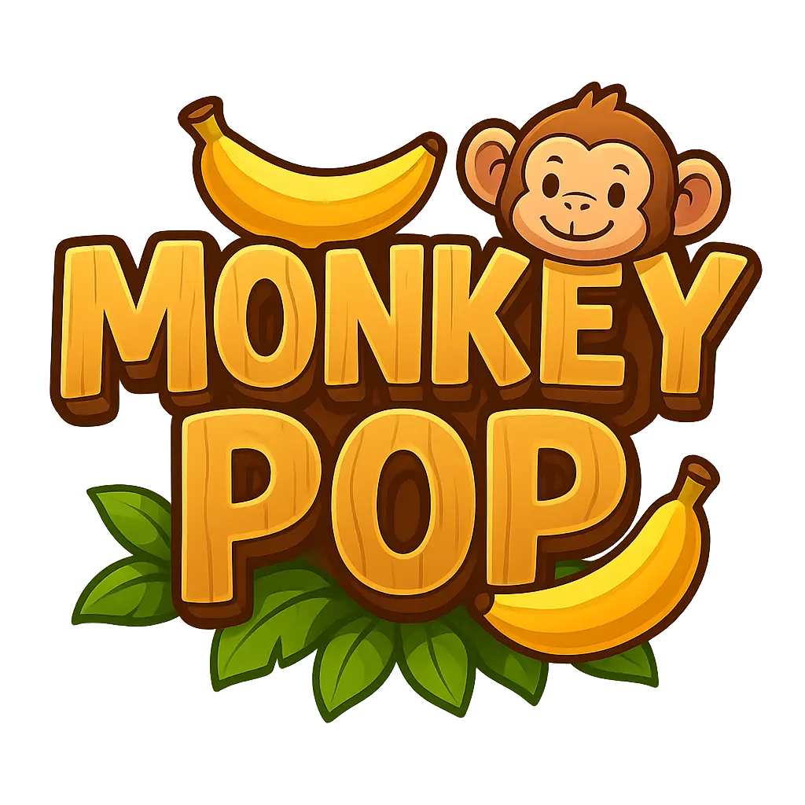

## Índice

1. [Descripción](#descripción)
   - [Tipos de Monos](#tipos-de-monos)
   - [Tipos de Globos](#tipos-de-globos)
   - [Sistema de Desbloqueo de Monos](#sistema-de-desbloqueo-de-monos)
2. [Tecnologías Utilizadas](#tecnologías-utilizadas)
3. [Roles del Equipo](#roles-del-equipo)
4. [Instalación y Ejecución](#instalación-y-ejecución)
5. [🚀 Deploy](#deploy)

## DESCRIPCIÓN
Somos el grupo A y Monkey Pop es un 'Tower Defense' un videojuego de estrategia, inspirado en el juego Bloons TD Battles, donde el objetivo es defenderse de los globos que avanzan por un camino, evitando que lleguen al final de este, haciendo uso de los monos que tienes a disposición.

El juego consta de aguantar todas las rondas posibles, las cuales se irán complicando exponencialmente apareciendo globos mucho más resistentes y rápidos.

### **Tipos de monos** 
Los jugadores pueden colocar distintos tipos de monos a lo largo del camino, cada uno con habilidades especiales:
- **Mono lanzador de dardos** : Dispara dardos rápidos para reventar globos.
- **Mono bomba** : Lanza explosivos para destruir grupos de globos.
- **Mono láser** : Usa un rayo láser para eliminar globos resistentes.
- **Mono congelador** : Ralentiza a los globos congelándolos.

### **Tipos de globos** 
Los globos no son todos iguales. Algunos presentan desafíos adicionales:
- **Globos resistentes**: Necesitan múltiples impactos para reventarse.
- **Globos camuflados**: Solo pueden ser vistos y atacados por ciertos monos.
- **Globos de plomo**: Son inmunes a ciertos tipos de ataques.
- **Globos de regalo**: Liberan otros globos al ser destruidos.

### **Sistema de desbloqueo de monos** 
Estamos evaluando dos posibles formas de desbloquear nuevos monos en el juego:
1) **Desbloqueo por niveles**: A medida que el jugador avanza, se desbloquean monos con nuevas habilidades.
   - Nivel 1: Mono lanzador de dardos (básico).
   - Nivel 3: Mono bomba.
   - Nivel 5: Mono de hielo.

2) **Compra con monedas**: Los jugadores ganan monedas al completar niveles o reventar globos. Estas monedas pueden usarse para comprar nuevos monos en una tienda dentro del juego.
   - Mono lanzador de dardos: Gratis (disponible desde el inicio).
   - Mono bomba: 500 monedas.
   - Mono de hielo: 1,000 monedas.
   - Mono súper láser: 2,500 monedas.

## TECNOLOGÍAS UTILIZADAS 
- **HTML5** → Estructura del juego y elementos de la interfaz.
- **CSS3** → Estilos y animaciones para una experiencia visual atractiva.
- **JavaScript** → Lógica del juego, interacción, detección de colisiones y mecánicas avanzadas.
- **React** → Estructura y lógica del juego

## ROLES DEL EQUIPO 
| Rol  | Nombre | Correo |
|------|--------------------------|--------------------------|
| CEO  | Alejandro Jiménez González | alejg411@uma.es |
| CIO  | Soraya Bennai Sadqi | sorayasadqui@uma.es |
| COO  | Marcos Luque Montiel | maarcoos_8@uma.es |
| CTO  | Francisco Ramírez Cañadas | franramirez@uma.es |
| CXO  | David Muñoz del Valle | davidmunvalle@uma.es |

## INSTALACIÓN Y EJECUCIÓN 
1. Clonar el repositorio:
   ```sh
   git clone https://github.com/DRLKs/Monkey-Pop.git
   
2. Moverse al directorio correspondiente:
   ```sh
   cd Monkey-Pop

3. Instalar dependencias:
   ```sh
   npm install

4. Cargar:
   ```sh
   npm run dev

## Deploy
La aplicación final está subida a GitHub pages, por tanto:
🌐 [Monkey-Pop](https://drlks.github.io/Monkey-Pop/#/)  


